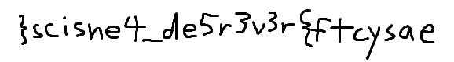

<h1>Challenge: Scisnerof</h1>
<h1>Category: Forensics</h1>
<h2>70 points</h2>

Description:

Written by neptunia

I found weird file! elif

Hint:  Did I put this in the wrong category? 

File = elif

<a href="./../files/6c0baad166c1256a29d469bae8a778ce5012ba77_elif">6c0baad166c1256a29d469bae8a778ce5012ba77_elif</a>

```
<pre> ‚`B®DNEI    °ґ&;н°.ыюя–!Bc$`x„!	Њ‘Ѓв„&2BН†–№?Ш¦в„ЖH)Ће醙==<¦в…Ё№Ћеи¦в„ЖH№Ћеи¦в„ЖH‰ЋеиЦв…Ё‰ЋеиЦв„ЖHГхъ`ЁqB}Ф.Д“ Еm w„&2Aw/@a¦Пзуаw„&2ALw/Aч„'}ALw/Aч„&2DwЛуWЌЬB˜Йњw/ъ<nв„ЖH}ЕЇgїГw„&2DШњ я{€B^ўlN‰Jфь/—
<...>
гшю?‚њB#Д!LdЊ„!1’0<B„ЖHАсB#Д!LdЊ„!1’0<B„ЖHАсB#Д!LdЊ„!1’0<B„ЖH°сBџчyй®’OsrT’·%uOОg«єJ©+sщ;ѕtчЧО>Ж<ђч"D‰$JЬHђа‘+•ИА<+‘"DЋWЕ5$љЇќн^xTADI&  dЁoЗГ  Г  sYHp	   aьЏ±  AMAg   йО® BGRs   оЌDz   P   B  RDHI
   


GNP‰ 
```

As I can see it is all about mirorring the text (Scisnerof is forensics, elif is file, GNP at the end of file is PNG, and so on).

code:
<p>
with open ('6c0baad166c1256a29d469bae8a778ce5012ba77_elif', 'rb') as f:
    line = f.read()
line = line[::-1]
with open ('text.png', 'wb') as out:
    out.write(line)
</p>

And we have the flag:


flag = easyctf{r3v3r5ed_4ensics}
